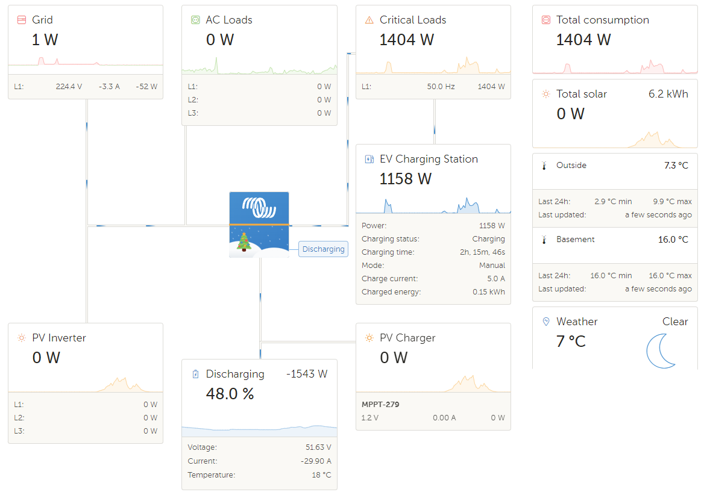

# dbus Victron Lektrico Charger Integration
This Python script integrates the Lektri.co EV Charger into Victron Energy Venus OS, allowing seamless communication between the charger and VictronOS. 

## Overview
With the scripts in this repo it should be easy possible to install, uninstall, restart a service that connects the Lektri.co to the VenusOS and GX devices from Victron.
Idea is inspired on @vikt0rm project and linked below.


## Inspiration
This project is my first with the Victron Venus OS, so I took some ideas and approaches from the following projects: 
- https://github.com/vikt0rm/dbus-goecharger
- https://github.com/victronenergy/venus/wiki/dbus#pv-inverters
Many thanks for sharing the knowledge.

## How it works

- Real-time monitoring of EV Charger parameters.
- Control EV Charger operations through VRM or CerboGX device.
- Integration with Victron Energy system metrics.

## Installation
Get the code

Just grap a copy of the main branche and copy them to a folder under /data/ e.g. /data/dbus-letrico-evcharger. 
After that call the install.sh script.

The following script should do everything for you:
```
wget https://github.com/rechin304/dbus-lektrico-evcharger/archive/refs/tags/v12.01.zip
unzip v12.01.zip "dbus-lektrico-evcharger-12.01/*" -d /data
mv /data/dbus-lektrico-evcharger-12.01 /data/dbus-lektrico-evcharger
chmod a+x /data/dbus-lektrico-evcharger/install.sh
/data/dbus-lektrico-evcharger/install.sh
rm v12.01.zip
```
⚠️ Check configuration after that - because service if is already installed an running and with wrong connection data (host) you will spam the log-file

## Configuration

1. Edit the `config.ini` file to configure your Lektri.co charger and system parameters.
	Host= Lektri.co station hostname or IP
	EM_Host = Lektri.co EM hostname or IP
	
| Section  | Config vlaue | Explanation |
| ------------- | ------------- | ------------- |
| DEFAULT  | AccessType | Fixed value 'OnPremise' |
| DEFAULT  | SignOfLifeLog  | Time in minutes how often a status is added to the log-file `current.log` with log-level INFO |
| DEFAULT  | Deviceinstance | Unique ID identifying the shelly 1pm in Venus OS || DEFAULT  | Phase | Valid values L1, L2 or L3: represents the phase where pv inverter is feeding in |

| ONPREMISE  | Host | IP or hostname of on-premise Lektri.co web-interface |
| ONPREMISE  | EM_Host | IP or hostname of on-premise Lektri.co EM web-interface |


## Usage

- The script will automatically update D-Bus with real-time data from the Lektri.co charger.
- Control the charger by updating specific D-Bus paths (e.g., `/StartStop`, `/SetCurrent`, `/Mode`) vi VRM or CeboGx (rpi)

## D-Bus Paths

- `/Ac/Power`: Instantaneous power in Watts.
- `/Ac/L1/Power`, `/Ac/L2/Power`, `/Ac/L3/Power`: Power for each phase. Lektri.co 1p7k only use L1
- `/Ac/Energy/Forward`: Accumulated energy consumption in kWh.
- `/ChargingTime`: Time elapsed since the start of charging in seconds.
- `/Ac/Voltage`: Voltage of the charger.
- `/Current`: Current in Amperes.
- `/SetCurrent`: Set charging current.
- `/MaxCurrent`: Maximum charging current.
- `/MCU/Temperature`: MCU temperature in degrees Celsius.
- `/StartStop`: Start or stop charging.
- `/Mode`: Charging mode (see below).

Charging modes

| Lektri.co | Victron |
 ------------- | ------------- |
| Power | Scheduled Charging |
| Hybrid | Manual |
| Green | Auto |

## Contributing

Feel free to contribute to this project by submitting issues or pull requests. Your feedback and contributions are highly appreciated.

### Details / Process
As mentioned above the script is inspired by @vikt0rm of dbus-goecharger implementation.
So what is the script doing:
- Running as a service
- connecting to DBus of the Venus OS `com.victronenergy.pvcharge.http_{DeviceInstanceID_from_config}`
- After successful DBus connection Lektri.co is accessed via REST-API and a JSON is returned with all details
  A sample JSON file from Lektri.co Station and EM can be found(/docs/charger_info-sample.json and /docs/app_config-sample.json)
- Serial is taken from the response as device serial
- Paths are added to the DBus
- After that a "loop" is started which pulls Lektri.co Station and Lektri.co EM data every 500ms from the REST-API and updates the values in the DBus

Thats it 😄

### Pictures





## Used documentation
- https://github.com/victronenergy/venus/wiki/dbus#evcharger   DBus paths for Victron namespace
- https://github.com/victronenergy/venus/wiki/dbus-api   DBus API from Victron
- https://www.victronenergy.com/live/ccgx:root_access   How to get root access on GX device/Venus OS
